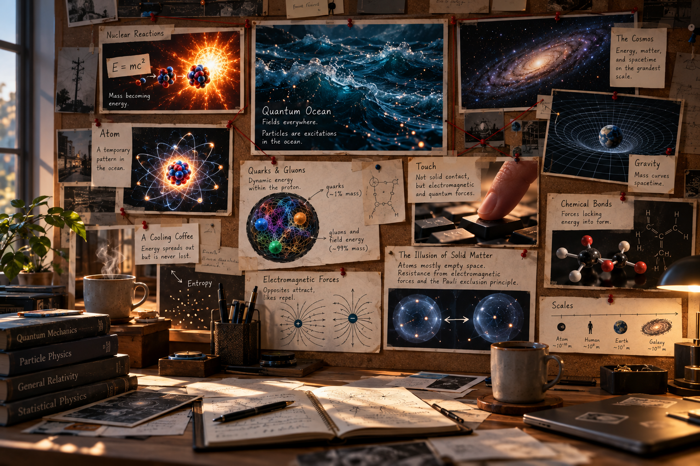

The exploration began with a straightforward premise: **is all energy essentially just excited electrons?** While electrons govern electricity and chemistry, this question served as the gateway into a much deeper unraveling of how the physical universe operates.

## **Energy as a State, Not a Substance**

The first major leap in the dialogue tackled the nature of chemical and nuclear reactions. If fusing hydrogen into helium generates massive amounts of heat, is energy simply the reaction itself?

The critical realization here requires a shift in how we define energy. **Energy is not a material or a mysterious fluid.** It is a physical quantity associated with the *state* of a system. In a reaction like hydrogen fusion, mass doesn't simply melt down into a substance called "energy." Instead, the total rest mass of the final system (helium) is smaller than that of the initial system. The difference appears as energy carried by radiation and the kinetic energy of the products, governed by Einstein's *E=mc²*.

This logic prompted a historical inquiry: Did Einstein start with fusion to discover this theory, and since energy can't be destroyed, where does heat go when a coffee cup cools down?

Einstein actually deduced this via a thought experiment about a moving body emitting light. He realized that for physical laws to remain consistent, the emitting body must lose mass. As for the cooling coffee, the energy is never lost; it simply spreads out into the environment, becoming less concentrated—a process known as entropy.

## **The Quantum Structure of Mass**

The dialogue then pushed past the traditional boundaries of chemistry. If mass and energy are interchangeable, what does it actually mean for a physical system to possess energy? Is it an atom, a neutron, or plasma?

This brings us to the structure of the atom. We tend to think of mass as solid stuff, but looking inside a proton reveals a different reality. A proton is composed of quarks, but if you add up the mass of those individual quarks, they account for roughly 1% of the proton's total mass.

The other 99% does not come from quarks simply "zooming around." The proton's mass arises predominantly from the energy associated with Quantum Chromodynamics (QCD).

This includes the energy of the gluon fields (the force carriers of the strong interaction), the complex dynamics between quarks and gluons, the mechanics of color confinement, and the baseline energy of the QCD vacuum itself. Mass, at this level, is deeply tied to the binding energy of the system.

## **The Quantum Ocean (An Analogy)**

To visualize how everything connects, we can imagine the universe as a vast "Quantum Ocean." However, this must be explicitly labeled as an analogy: **quantum fields are not literally fluids filling space.** They are mathematical entities—properties that exist at every point in spacetime.

In this analogy, matter is not a solid object dropped into the ocean; matter is a *localized excitation* of these fields. You can imagine that excitation as a whirlpool in the ocean.

Every electron in the universe is simply an excitation in the universal electron field.

## **The Pauli Exclusion Principle and the Illusion of Touch**

Applying this to the macro world, a practical thought experiment was introduced: what happens when a finger presses a key on a keyboard? The intuition was sharp—kinetic energy is transferred without the atomic structures breaking down.

But the physics of why your finger doesn't pass through the keyboard is strictly quantum mechanical. When your finger presses against the key, electromagnetic interactions between the atoms become strongly repulsive at short distances. However, ordinary matter's resistance to compression relies heavily on the **Pauli exclusion principle**.

This quantum-mechanical law prevents fermions (like electrons) from collapsing into the same quantum states. It is this principle, combined with electromagnetic repulsion, that provides the physical resistance we interpret as "touch."

## **The Macro Shift: Gravity and General Relativity**

Zooming out to the planetary scale, the question arose: how do these interactions work for planets?

Quantum mechanics absolutely still applies to planets—they are, after all, made entirely of quantum particles. However, quantum effects become negligible at macroscopic scales for ordinary planetary systems. Because astronomical bodies are approximately electrically neutral (their positive and negative charges balance out), electromagnetic forces don't dictate their large-scale movements.

Instead, gravity dominates.

At planetary scales, the dominant large-scale description of gravity is General Relativity, where massive bodies dictate the dynamics of the cosmos by curving the geometry of spacetime itself.

## **The Grand Conclusion**

The conversation culminated in a synthesized realization: *Energy is a physical quantity tied to these fundamental interactions. Until a system's state changes, it remains stable. When interactions occur, the state of the system shifts, resulting in different types of energy releases.*

Whether it is the strong interaction holding a proton together, the Pauli exclusion principle stopping a finger from phasing through plastic, or the curvature of spacetime guiding a planet, the universe is dictated by these fundamental laws—and energy is the physical quantity we use to measure the state of it all.
